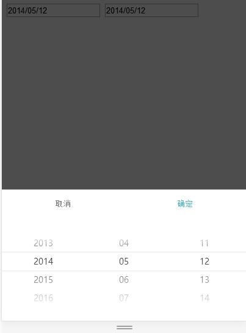

# mobile-select-date
手机联动选择日期
效果图如下：

例子见[DEMO](http://www.lovewebgames.com/jsmodule/mobile-select-date.html)  
#用法
	<!DOCTYPE>
	<html>
		<head>
			<title>时间选择器</title>
			<meta name="viewport" content="width=device-width, initial-scale=1.0, maximum-scale=1.0, user-scalable=0">
			<link rel="stylesheet" type="text/css" href="../dist/mobile-select-area.css">
			
			
			
			
		</head>
		<body>
			<input type="text" id="txt_date"/>
			
		</body>
	</html>
#属性及方法
##default:`0||1`
	0为空,true时默认选中第一项,默认1
##trigger:
	触发弹窗的DOM元素 ，可以是input或其他
#callback:
	选中后的回调，默认有填充trigger的value值，以‘/’分隔
##value`YYYY/MM/dd`
	默认值
##min:`string`
	最小值,默认""1900/01/01""
##max:`string`
	最大值，默认当前时间